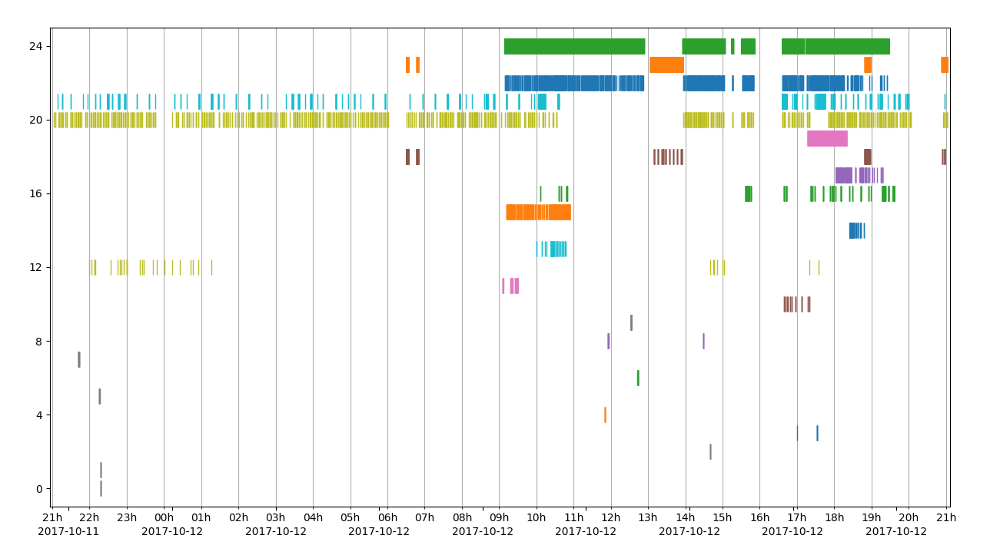

# probemon
probemon is a simple command line tool for logging data from 802.11 probe request frames with tools to plot mac presence and get statistics.

This rewritten version of probemon uses an sqlite DB like in probeSniffer, as the log can quickly grow over time. It does not hop on channels as you lose more traffic by hopping than by simply staying on a major channel (1,6,11).

This simple python script uses under the hood scapy.
A tool using matplotlib allows you to draw a chart to visualize easily the mac address presence over time.
Another tool presents statistics about the mac addresses present in the database.

## Usage
### probemon.py
```
usage: probemon.py [-h] [-c CHANNEL] [-d DB] -i INTERFACE [-I IGNORE] [-n]
                   [-s]

a command line tool for logging 802.11 probe request frames

optional arguments:
  -h, --help            show this help message and exit
  -c CHANNEL, --channel CHANNEL
                        the channel to listen on
  -d DB, --db DB        database file name to use
  -i INTERFACE, --interface INTERFACE
                        the capture interface to use
  -I IGNORE, --ignore IGNORE
                        mac address to ignore
  -s, --stdout          also log probe request to stdout
```

### plot script
This script simplifies the analysis of the recorded data by drawing a chart that plots the presence of
mac address via the recorded probe request.

```
usage: plot.py [-h] [-b DB] [-d DAYS] [-i [IMAGE]] [-l] [-k KNOWNMAC] [-m MIN]
               [-M MAC] [-p] [-r RSSI] [-s START]

Plot MAC presence from probe request sniff

optional arguments:
  -h, --help            show this help message and exit
  -b DB, --db DB        file name of the db
  -d DAYS, --days DAYS  number of days to keep
  -i [IMAGE], --image [IMAGE]
                        output an image
  -l, --legend          add a legend
  -k KNOWNMAC, --knownmac KNOWNMAC
                        known mac to highlight in red
  -M MIN, --min MIN     minimum number of probe requests to consider
  -m MAC, --mac MAC     only display that mac
  -p, --privacy         merge LAA MAC address
  -r RSSI, --rssi RSSI  minimal value for RSSI
  -s START, --start START
                        start timestamp
```

* -d/--days specify the number of days that will lapse the chart from 12AM to 12AM.
* -k/--knowmac (can be repeated) to specify known mac address that will be colored in red.
* -p/--privacy switch merges all Locally Administered Addresses (MAC) into a single plot. Whether this option is used or not, they are colored in grey.
* -m/--min allows specifying the minimum of probe requests that are needed to be displayed on the chart.
* -r/--rssi allows filtering probe request based the RSSI value
* -s/--start allows to specify a date (%Y-%m-%d) or a timestamp (without seconds) (%Y-%m-%dT%H:%M) where to begin to draw the chart


When displayed by the script, one can hover the mouse on the plot to get the mac address, and the timestamp.
When you export to an image, you lose that feature but you can add a legend instead.

### stats script
It allows you to request the database about a specific mac address and get statistics about it,
or filter based on a RSSI value. You can also specify the start time and end time of your request.
```
usage: stats.py [-h] [-a AFTER] [-b BEFORE] [-d] [--db DB] [-l] [-m MAC]
                [-r RSSI] [-p] [-z]

Find RSSI stats for a given mac

optional arguments:
  -h, --help            show this help message and exit
  -a AFTER, --after AFTER
                        filter before this timestamp
  -b BEFORE, --before BEFORE
                        filter after this timestamp
  -d, --day             filter only for the past day
  --db DB               file name of database
  -l, --log             log all entries instead of showing stats
  -m MAC, --mac MAC     filter for that mac address
  -r RSSI, --rssi RSSI  filter for that minimal RSSI value
  -p, --privacy         merge all LAA mac into one
  -z, --zero            filter rssi value of 0
```

# Notes
This is still using python2 😳 🤦 🕳️. This is easily converted to python3 script with 2to3 though.

The dependencies are:
* for probemon.py: scapy, python-netaddr
* for stats.py: None
* for plot.py: matplotlib, cycler

## Locally Administered Addresses

> A locally administered address is assigned to a device by a network administrator, overriding the burned-in address.

> Universally administered and locally administered addresses are distinguished by setting the second-least-significant bit of the first octet of the address. This bit is also referred to as the U/L bit, short for Universal/Local, which identifies how the address is administered.
(source Wikipedia)

These type of MAC addresses are used by recent various OS/wifi stack to send probe requests anonymously, and using at the same time randomization.

So it defeats tracking and render probemon useless in that case. But not all devices are using this randomization technique, yet.

## Device behavior
It should be noted that not all devices are equal. They vary a lot in behavior regarding of the probe requests (PR). This should be taken into account when analyzing the data collected.

Depending on the type of device (PC/laptop/..., printer, mobile phone/tablet, IoT device), the OS used (Linux, Windows, Android, MacOS/iOS, unknown embedded OS, ...) the wifi chipset and/or the wifi/network stack, one device behave differently from one another when sending probe request.

Even phone using the same OS like android, can behave differently: some send PR every 30 seconds, while others only send PR when the screen is unlocked.
